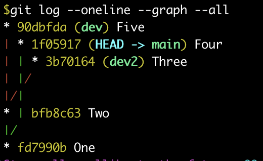

<br>
<br>


<div align="center">
  
</div>

<br>
<br>

---

## **创建新的repo** 

```
#in github.com
login and create an repository with a README
add your ssh public keys to get recognized by github.com

#in local computer
git clone git@github.com:username/repo_name.git # by ssh. https one is slower.
cd repo_name
#creat everything you want to include. you con use git to track versions during the process
git add .
git commit -m 'first time submmit to the repository'
git remote -v #should show the origin has been bound. 
git push -u origin main
```
`git push -u origin master` if you see `master` from `git branch`

---

## **为本地目录建立repo并推到github.com**
```
#in local computer
cd the_folder_want_to_give
git init
git add .
git commit -m 'comments' 

#in github.com
add your ssh public keys to get recognized by github.com
create a repo WITHOUT a README

#back in local computer
#binding the remote repo
git remote add origin git@github.com:username/repo_name.git
git push -u origin main     # -u for first time push 
```


---

## **check where you are**

`git status` to know what is the process your workspace is in

`git branch` 查看当前的分支

`git log --oneline --graph --all` 展示所有分支的关系

`git diff $file` check the changes made to a file 

`git log`  check commit history for current process. optional: `--pretty=oneline`

`git reflog` check every activity you did.

`git diff HEAD -- $file`  查看工作区和版本库里面最新版本的区别. `--` 是当前分支？

## **配置Git**
```
git config --global user.name "Your name"
git config --global user.email "email@eexample.com"

#Information stored at ~/.gitconfig
#Shown as who edit/submit
```


## **commit a deletion** 

在workspace删除文件， then `git rm <file>` and then `git commit -m "comment"`


## **return to a version**
```
git reset --hard `commit id`  ## 本质是移动HEAD指针(即master branch)

```
```
--hard	#回退到上个版本的已提交状态
--soft	#回退到上个版本的未提交状态
--mix	#回退到上个版本已添加但未提交的状态
```

special commit id
```
HEAD^		# last committed status
HEAD^^		# version before last version
HEAD~100	# 100th backwards version
first few digits are enough
```
### 撤销修改
`git restore --staged <file>...` to unstage. 把add到暂存区的修改撤销掉（unstage），重新放回工作区
`git restore <file>...` to discard changes in working directory 本质是让这个文件回到最近一次git commit或git add时的状态。是用版本库里的版本替换工作区的版本。 `--` 是当前分支？


## binding workspace to a remote repository
```
git remote -v  #check the information of remote repository

git remote rm origin # delete it if the remote is wrong
git remote add origin git@github.com:username/repo_name.git

or 

git remote set-url origin git@github.com:username/repo_name.git
```

---
## **Branch** 
<table>
  <tr>
    <td></td>
    <td>
      branch main: commit One and Four<br>
      branch dev: split from commit One and commit Two and Five <br>
      branch dev2: split from commit Two and commit Three <br>
      <br>
      Common commits are inhereited by new split. So delete dev won't delete Two <br>
      <br>
      ** Changes are not bound to any branches before added to index.  
    </td>
  </tr>
</table>

---

## **修改代码的同时使原版本继续运行**
```
git checkout -b new_branch
#change, add and commit
git switch main # others will always see what is in the workspace
```

## **合并分支**
```
git switch main
git merge branch_name # 用于合并指定分支到当前分支
# if there are conflicts(new versions exist afrer splitting)
#	1. abort merging by `git merge --abort`
#	2. `git status` to see where is the conflict
#	   change the file manually to decide the final version
#	   `git add <file>` and `git commit -m "comment" `
#	   ` git log --graph --pretty=oneline --abbrev-commit` to see the merging graph
#	   `git branch -d branch_name` # 没有merge的分支删除时会报错，强制删除可用-D 
```

## **暂时将工作现场保留而进行另外的工作**

**Changes are not bound to any branches before added to index. stash is targeting at workspace with index.**
```
git stash
`git stash list` should see it done and `git status` hides
```
恢复
```
`git stash apply` and `git stash drop` # delete the stash manually
or
`git stash pop` # delete it automatically

`git stash list` should see nothing
```

## **复制分支上的某次修改（某个 commit）到 main**
```
git switch main
git cherry-pick <commit_id>
```

## **tag version number**
**标签是取别名，打在commit id上**
```
git tag -a v0.1 -m "version 0.1 released" <commit_id>

```


